#笔记

#项目初始分析

src/main.js
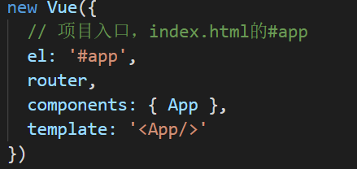
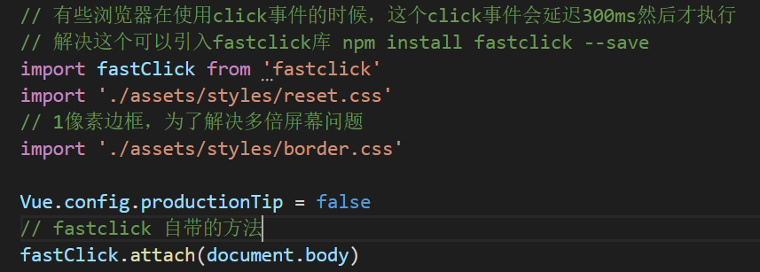

tempalte模板里面向外暴露只能暴露一个根标签

**src/App.vue 是整个项目的根组件**

整个项目只有static目录下的，可以被外部访问到，所有把本地用到的模拟数据都放在该目录下

##路由的概念
路由就是根据网址的不同，返回不同的内容给用户
路由的配置都放在router文件夹下的index.js文件里

src/App.vue
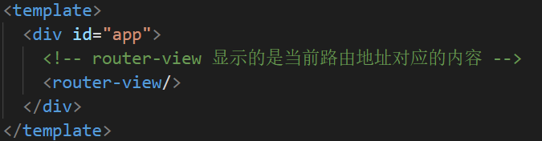

**当使用keep-alive的时候，会多出来一个，生命周期钩子activated，页面虽然不会再被重新渲染。但是页面再重新显示的时候，会执行activated生命周期钩子，可以通过这个再次发送ajax请求**
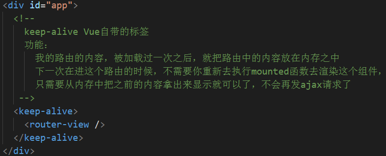

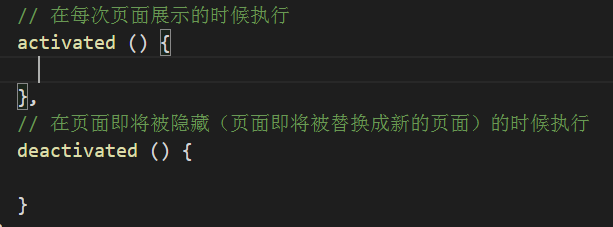

src/router/index.js
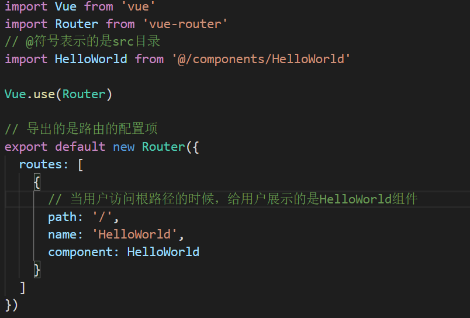

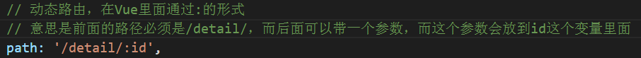

##跳转页面

Vue项目中一般不用a标签跳转，用router-link标签进行跳转

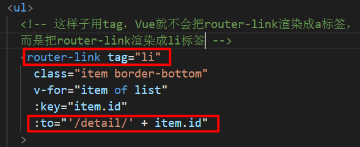

##单页应用
通过JS判断页面，如果页面跳转则清除组件再渲染上新的组件（JS渲染）
不会每到一页请求一个html文件
优点：页面切换快
缺点：首屏时间稍慢（先请求一个html文件，再请求js），SEO差（搜索引擎只认识html的内容）

##样式限定
style标签上加scoped属性
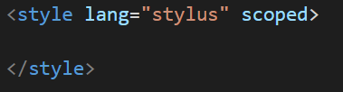

##样式穿透
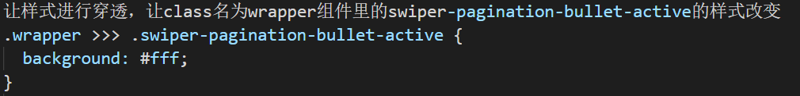

##vuex
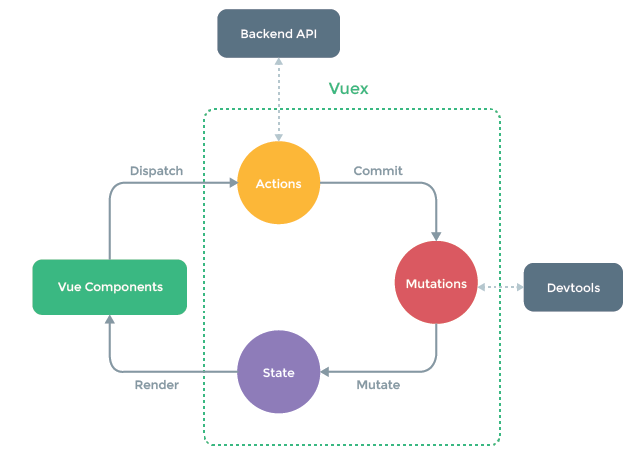

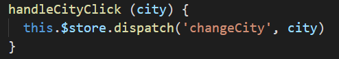

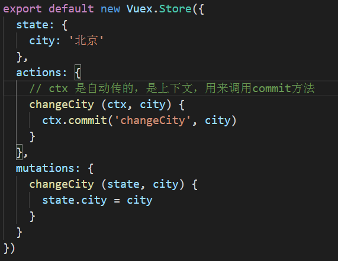
