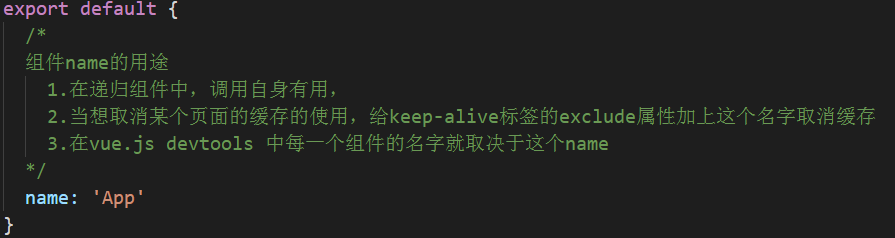
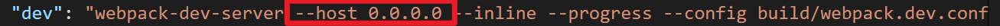
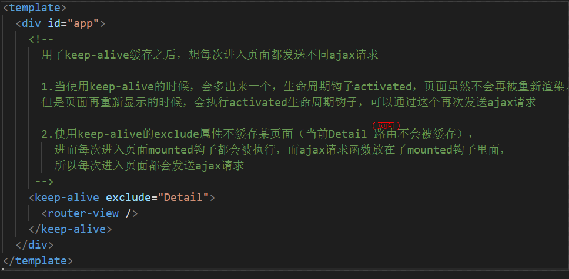
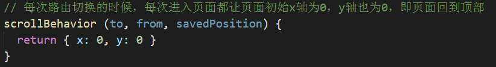
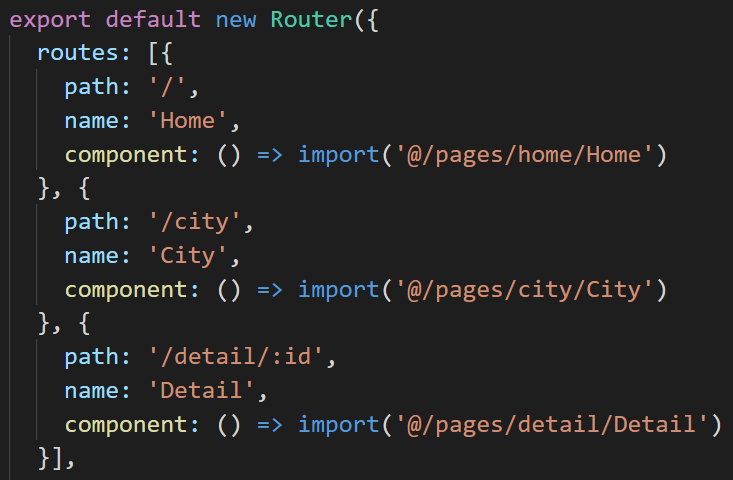

#笔记

#项目初始分析

src/main.js

tempalte模板里面向外暴露只能暴露一个根标签

**src/App.vue 是整个项目的根组件**

整个项目只有static目录下的，可以被外部访问到，所有把本地用到的模拟数据都放在该目录下

**如果要真机测试的话，只要在启动方式加上这个就好了**

##路由的概念
路由就是根据网址的不同，返回不同的内容给用户
路由的配置都放在router文件夹下的index.js文件里

src/App.vue

src/router/index.js

##跳转页面

Vue项目中一般不用a标签跳转，用router-link标签进行跳转

##单页应用
通过JS判断页面，如果页面跳转则清除组件再渲染上新的组件（JS渲染）
不会每到一页请求一个html文件
优点：页面切换快
缺点：首屏时间稍慢（先请求一个html文件，再请求js），SEO差（搜索引擎只认识html的内容）

##样式限定
style标签上加scoped属性

##样式穿透

##vuex

##异步组件

**按需加载js，当打包过的app.js文件很大的时候，才进行拆分，不然多好多ajax请求更加不好**

**不是异步的形式**

**异步加载形式**

